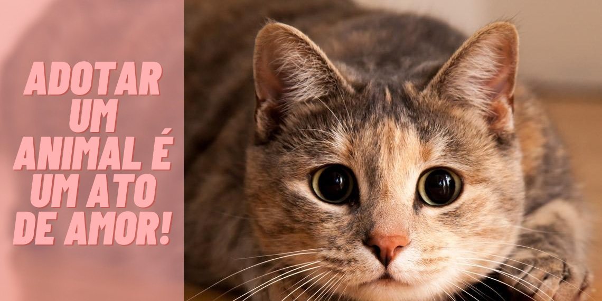

<h1 align="center"> CatPurr </h1>

  <a href="#-tecnologias">Tecnologias</a>&nbsp;&nbsp;&nbsp;|&nbsp;&nbsp;&nbsp;
  <a href="#-projeto">Projeto</a>&nbsp;&nbsp;&nbsp;|&nbsp;&nbsp;&nbsp;

 

  

## Tecnologias

Esse projeto foi desenvolvido com as seguintes tecnologias:

- HTML
- CSS
- Git
- GitHub

## Projeto

O CatPurr é um projeto criado a partir das aulas do curso de engenheiro front-end da Instituição EBAC (Escola Britânica de Artes Criativas e Tecnologia).

- [Visite o projeto online](https://catpurr-projeto1-ebac.vercel.app/)

